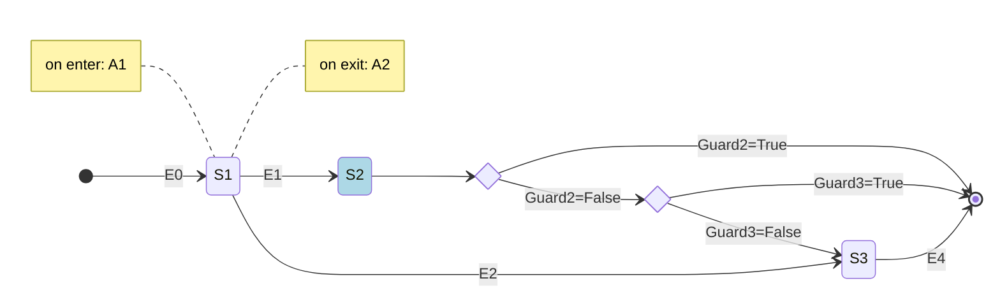

# Spring Statemachine demo - Persist

Esta aplicación es un pequeño ejemplo del uso de Spring Statemachine con persistencia JPA.

La configuración utilizada es muy simple, se utiliza un interceptor para detectar y registrar en la BD los
cambios de estado el que se materializan.

Para la implementación de flujos simples debería ser suficiente.

En el ejemplo se debe notar que los cambios de estado se ejecutan en un método anotado como `@Transactional`.
Esto para tratar de evitar que dos instancias realicen cambios simultáneos en la máquina.
El registro en la BD de los cambios de estado se ejecuta utilizando un interceptor.
En el repositorio para la solicitud `SolicitudJpaRepository` se ha implementado el método findByIdLocked con la anotación `@Lock`
para impedir que otras instancias de la máquina puedan actuar sobre el registro durante un cambio de estado.
```
  @Lock(LockModeType.PESSIMISTIC_WRITE)
  Optional<SolicitudJpaEntity> findByIdLocked(Long aLong);
```
Esta no es la configuración ideal, pues bloquea todas las lecturas de ese registro durante el cambio de estado,
pero por ahora es la única forma que he encontrado de garantizar que no se ejecuten cambios simultáneos.

:warning::point_right: **Se debe tener especial cuidado de reducir al mínimo el tiempo de ejecución durante la transacción
(la transición de la máquina de estados) debido a que durante ese tiempo se bloquea una de las conexiones
a la base de datos disponibles, lo que podría producir errores o lentitud.**

La máquina implementada es la siguiente:


- Las solicitudes comienzan en el estado inicial al momento de crearse.
- El estado S1 tiene asociada una acción de entrada y una de salida.
- El estado S2 es un pseudo-estado de choice, esto quiere decir que cuando una solicitud llega a ese estado
inmediatamente se evalúan las condiciones asociadas y la máquina se mueve al estado resultante (S3 o estado final).

## ¿Cómo utilizar este ejemplo para integrar Spring Statemachine en mi proyecto?

Usar este código como base para integrar SSM en otro proyecto es relativamente simple,
los pasos son los siguientes:
1. Agregar las dependencias de SSM en `build.grade:
   ```groovy
    // Spring Statemachine
    implementation 'org.springframework.statemachine:spring-statemachine-starter:3.2.0'
    implementation 'org.springframework.statemachine:spring-statemachine-recipes-common:3.2.0'
   ```
2. Copiar el paquete `com.modyo.ms.commons.statemachine` en el proyecto (más adelante integraremos este código en modyo-ms-commons y este paso no será necesario) :wink:
3. Definir los estados y eventos de la máquina (puedes hacerlo creando enums como los que están en `com.modyo.test.statemachine.domain.enums`)
4. Definir la máquina de estados usando como ejemplo `com.modyo.test.statemachine.config.StateMachineConfig`
5. Definir un Listener para persistir los cambios de estado extendiendo `AbstractPersistStateChangeListener` (puedes usar como ejemplo `com.modyo.test.statemachine.application.service.LocalPersistStateChangeListener`)

Eso es todo, ya tienes lista tu máquina de estados para usarla.

Ahora, solamente tienes que preocuparte de enviar los eventos de cambio de estado desde los
servicios al handler de la máquina, para esto puedes usar `StateMachineUtils.sendEvent`
````java
StateMachineUtils.sendEvent(stateMachineHandler, SM_ENTITY_HEADER, solicitud, solicitud.getState(), eventName);
````
o implementar tu propia versión con algo como lo siguiente:
```java
  private void sendEvent(Solicitud solicitud, String event) {
    log.info("sending event to statemachine: {} {}", solicitud.getId(), event);
    stateMachineHandler.handleEventWithStateReactively(MessageBuilder.withPayload(event)
            .setHeader(SM_ENTITY_HEADER, solicitud)
            .build(), solicitud.getState())
        .subscribe();
  }
```
en ambos casos:
- **solicitud** es el objeto de negocio que usas para mantener el estado.
- **event** es el nombre del evento que estás enviando a la máquina.
- **SM_ENTITY_HEADER** es una etiqueta que usas para identificar el objeto enviado dentro del mensaje.
- **solicitud.getState()** es el estado actual de la máquina.

## Pruebas de la máquina de estado
Para verificar el correcto funcionamiento de la máquina de estados se ha incluido
un test de integración que puede ejecutarse con `./gradlew testIntegration` y un [test de carga](src/k6/README.md)
que permite probar el correcto funcionamiento de la máquina de estados en condiciones de alta demanda.
