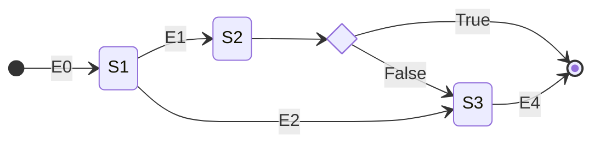

# Spring Statemachine demo

Esta aplicación es un pequeño ejemplo del uso de Spring Statemachine con persistencia JPA.

La configuración utilizada es la más simple, se implementa un interceptor para los cambios de estado el
que se utiliza para almacenar el estado actual de la máquina.

Para la implementación de flujos simples debería ser suficiente.

En el ejemplo se debe notar que los cambios de estado se ejecutan en un método anotado como `@Transactional`.
Esto para tratar de evitar que dos instancias realicen cambios simultáneos en la máquina.
El registro en la BD de los cambios de estado se ejecuta utilizando un interceptor.
En el repositorio para la solicitud `SolicitudJpaRepository` se ha implementado el método findByIdLocked con la anotación `@Lock`
para impedir que otras instancias de la máquina puedan actuar sobre el registro durante un cambio de estado.
```
  @Lock(LockModeType.PESSIMISTIC_WRITE)
  Optional<SolicitudJpaEntity> findByIdLocked(Long aLong);
```
Esta no es la configuración ideal, pues bloquea todas las lecturas de ese registro durante el cambio de estado,
pero por ahora es la única forma que he encontrado de garantizar que no se ejecuten cambios simultáneos.

La máquina implementada es la siguiente:


- Las solicitudes comienzan en el estado inicial al momento de crearse.
- El estado S2 es un pseudo-estado de choice, esto quiere decir que cuando una solicitud llega a ese estado inmediatamente se evalúa la condición asociada y la máquina se mueve al estado resultante (S3 o estado final)
