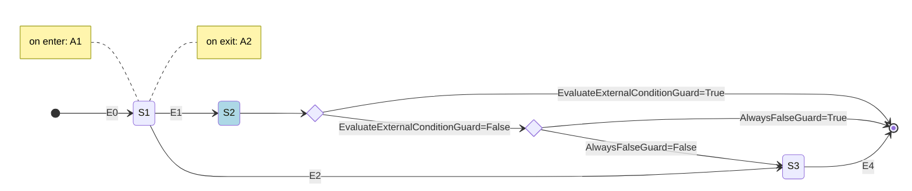

# Spring Statemachine demo - Persist

Esta aplicación es un pequeño ejemplo del uso de Spring Statemachine con persistencia JPA.

La configuración utilizada es muy simple, se utiliza un interceptor asociado a las transiciones para detectar y
registrar en la BD los cambios de estado cuando se materializan.

Esta configuración, para la implementación de flujos medianamente simples debería ser suficiente.
La configuración permite crear máquinas con secuencias de estados, con acciones asociadas a las entradas y salidas,
y configurar condiciones para la selección de rutas alternativas.

En el ejemplo se debe notar que los cambios de estado se ejecutan en un método anotado como `@Transactional`.
Esto es una estrategia para evitar que dos instancias del microservicio realicen cambios simultáneos en la máquina.

En el repositorio para la solicitud `SolicitudJpaRepository` se ha implementado el método findByIdLocked con la
anotación `@Lock` para impedir que otras instancias de la máquina puedan actuar sobre el registro durante un cambio de estado.
```
  @Lock(LockModeType.PESSIMISTIC_WRITE)
  Optional<SolicitudJpaEntity> findByIdLocked(Long aLong);
```
Esta no es la configuración ideal, pues bloquea todas las lecturas de ese registro durante el cambio de estado,
pero una forma simple para garantizar que no se ejecuten cambios simultáneos.

:warning::point_right: **Se debe tener especial cuidado de reducir al mínimo el tiempo de ejecución durante la transacción
(la transición de la máquina de estados) debido a que durante ese tiempo se bloquea una de las conexiones
a la base de datos disponibles, lo que podría producir errores o lentitud.**

La máquina implementada es la siguiente:


- Las solicitudes comienzan en el estado inicial al momento de crearse.
- El estado S1 tiene asociada una acción de entrada y una de salida, las que se ejecutan automáticamente.
- El estado S2 es un pseudo-estado de choice/junction, esto quiere decir que cuando una solicitud llega a ese estado
inmediatamente se evalúan las condiciones asociadas (Guards) y la máquina se mueve al estado correspondiente
según el resultado de las evaluaciones (S3 o estado final).

## ¿Cómo utilizar este ejemplo para integrar Spring Statemachine en mi proyecto?

Usar este código como base para integrar SSM en otro proyecto es relativamente simple,
los pasos son los siguientes:
1. Agregar las dependencias de SSM en `build.grade:
   ```groovy
    // Spring Statemachine
    implementation 'org.springframework.statemachine:spring-statemachine-starter:3.2.0'
   ```
2. Copiar el paquete `com.modyo.ms.commons.statemachine` en el proyecto
(más adelante integraremos este código en modyo-ms-commons y este paso no será necesario) :wink:
3. Definir los estados y eventos de la máquina (puedes hacerlo creando enums como los que están
en `com.modyo.test.statemachine.domain.model`)
4. Definir la máquina de estados usando como ejemplo `com.modyo.test.statemachine.config.StateMachineConfig`
5. Definir un Listener para persistir los cambios de estado extendiendo `AbstractPersistStateChangeListener`
(puedes usar como ejemplo `com.modyo.test.statemachine.application.service.StateChangePersistenceInterceptor`)
6. Opcionalmente, puedes extender `DefaultStateChangeLoggerListener` para
monitorear las transiciones ejecutadas y rechazadas.

Eso es todo, ya tienes lista tu máquina de estados para usarla.

Ahora, solamente tienes que preocuparte de enviar los eventos de cambio de estado desde los
servicios al handler de la máquina, para esto debes usar el bean de tipo StateMachinePersistStateChangeHandler como puedes
ver en SolicitudUseCaseService.
````java
stateMachineHandler.sendEvent(solicitud, solicitudId.toString(), solicitud.getState(), event);
````
Los parámetros son:
- **solicitud** es el objeto de negocio que usas para mantener el estado.
- **id** es el identificador del objeto de negocio (un String).
- **state** es el estado actual de la máquina para esta entidad.
- **event** es el evento que estás enviado a la máquina para procesar.

## Pruebas de la máquina de estado
Para verificar el correcto funcionamiento de la máquina de estados se ha incluido
un test de integración que puede ejecutarse con `./gradlew testIntegration` y un [test de carga](src/k6/README.md)
que permite probar el correcto funcionamiento de la máquina de estados en condiciones de alta demanda.
